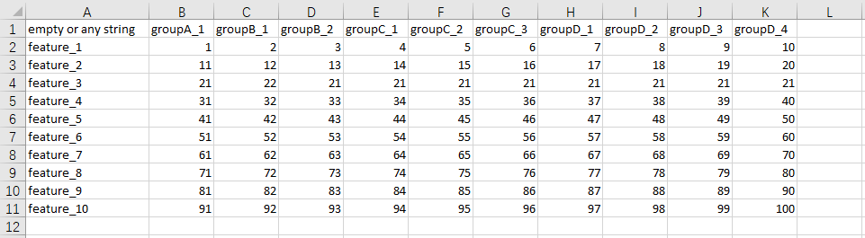

# File guide

## About format

csv是最不会出错的格式  
考虑到你有可能通过自己新建xlsx来导入数据，所以支持.xlsx，但请注意你实际处理的是哪张工作表  
因历史遗留原因，你可能想要上传.CSV, .XLSX，这样具有大写后缀名的文件，最好请自行转换，防止不必要的麻烦  
如果是.XLS文件，对不起，也请自行转换， 这是太老的产物了，已经被时代抛弃了  

## About content

单元格A1可以是任意字符或者空的，在处理过程中会被替换成"var"  
列名如果形如用\"prefix_detail_1\"的格式命名，对读取分组是有帮助的，内置函数会帮你提取出最后一个下划线前的所有字符，作为组名，对这处理缺失值和画图是有帮助的  
另外组内的样本数也不一定需要一样  
列名也可以是其他形式，甚至是无意义的数字，比如医院所寄来的样品，是用编号命名的，你只需要在Description中为他们赋予分组信息  
分组信息不是必须的，主要取决于你是否会用到需要读取分组信息的功能  
行名只要不重复即可，因为它可能是任何值，基因名称，蛋白名称，代谢物名称，所以此处均用feature指代  
